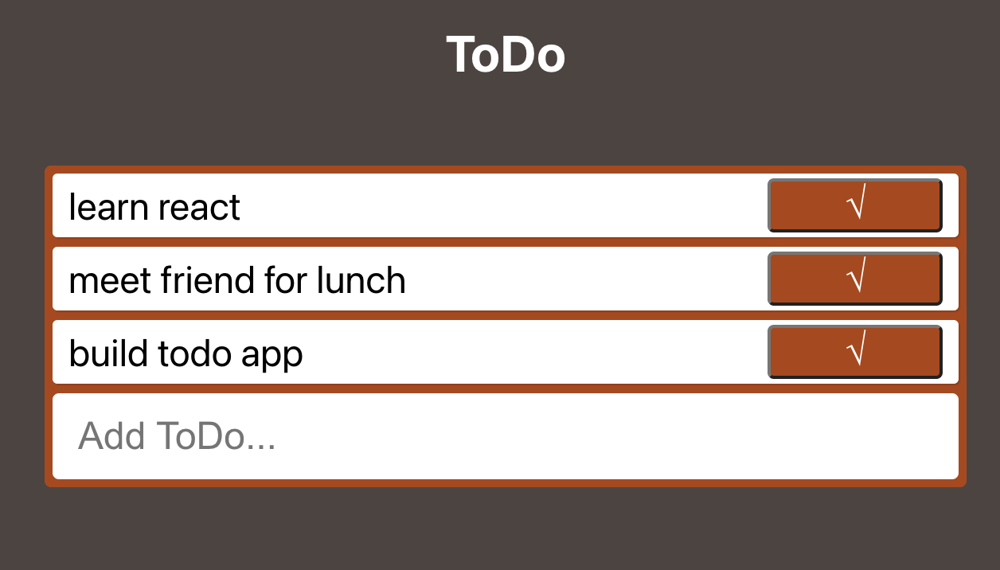

# ToDo List Using React 

## Description
This project is a simple ToDo form. Once the project is loaded it has three pre-filled ToDo items. Below the prefilled ToDo list the user then will be able to add to the list. To remove any completed items, the user will need to press the the corresponding checkmark for the completed task.

## Installation 
Download a copy of this repo. Open the repo in your favorite code editor and terminal to the project's directory.  

### `npm start`

Npm start runs the app in the development mode.\
Open [http://localhost:3000](http://localhost:3000) to view it in the browser.

The page will reload if you make edits.\
You will also see any line errors in the console.

## Usage
This project is an example of a form that is universal across many platforms. It uses React and Formik to create a more concise and logical code.

## Support
This project was bootstrapped with [Create React App](https://github.com/facebook/create-react-app).
You can learn more in the [Create React App documentation](https://facebook.github.io/create-react-app/docs/getting-started). To learn React, check out the [React documentation](https://reactjs.org/). Learn more about Formik in the [Formik documentation](https://formik.org/docs/overview).\
[MDN Web Docs](https://developer.mozilla.org/en-US/docs/Web/JavaScript)

## Roadmap
My goal for this project is to continue learn how to write in React to add more functions, such as the ability to keep track of previously completed tasks.

## License Information
MIT
